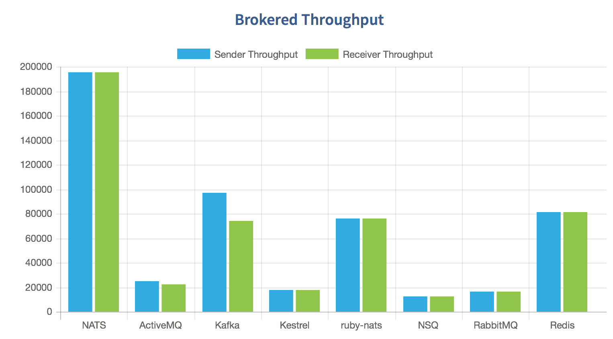
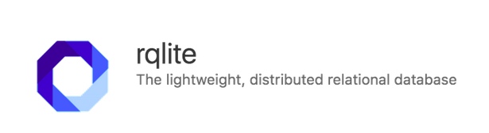

# Blep
A high availability log sourcing tool for modern DevOps

<br />


[](https://www.youtube.com/watch?v=u2-FNYZKUsE&feature=youtu.be) 

 [](https://www.linkedin.com/in/angad-sharma-07bb38122/) 


<br/>

### Implementation
---

- [X] Decentralizing calls to a distributed log-store, `rqlite`
- [X] Fast logs sourcing using `NATS` and `gRPC`
- [X] Low bottlenecking
- [X] Abstraction between persistent (subscriber) and application (publisher) layer
- [X] Easily deployable and testable image build
- [X] Easy integration with an existing ELK stack
- [X] Seamless integration across different codebases
- [X] Self contained binaries
- [X] Inbuilt analytics and benchmarks
- [X] `Mormon` CLI interface

<br />

<details>

<summary>Technology stack</summary>

### Why NATS?
---
[NATS](https://github.com/nats-io/go-nats.git) is an event sourcing tool which we will be using to publish logs and distribute related data between different services. The reason for NATS is:

* RabbitMQ is limited to HTTP and HTTPS natively

* NATS supports gRPC and works fast due to being type safe as well as removing extra overhead of marshalling and unmarshalling

* Publishing events on a different thread and subscribing from a different thread allows non-blocking log sourcing.

* NATS is very high throughput when it comes to requests per second

<br />



<br />
<br />

### The need for a distributed DB
---
Different containers consuming from a single DB lead to network bottlenecking. distributed databases give us the advantage in terms of reducing request overhead. In this implementation we have used [rqlite](https://github.com/rqlite/rqlite.git), because:

* It is very lightweight, and written in go

* Forming a cluster is very easy.    

* It is fast and fault tolerant

* It has an inbuilt backup and recovery mechanism


<br />




<br />

</details>

## Introducing the blep CLI

```
usage: blep [subcommand] [args]
blep build <----------------------------------------------------------> build from source, go needed
blep run-env <--------------------------------------------------------> run the nats and rqlite env
blep run-safe-env <---------------------------------------------------> run-env for the case docker-compose is not present
blep run-env stop <---------------------------------------------------> stop the nats and rqlite env
blep start -p [port] <------------------------------------------------> stop the nats and rqlite env
blep publisher [logId] [timestamp] [log] [host] <---------------------> publish an event
blep subscriber logs.[host] [callback executible] <-------------------> subscribe for an event
blep mock-logs <------------------------------------------------------> generate logs for testing
```

<br />


## Project instructions

<details open>
<summary>Build environment specification</summary>
<br/>

#### Run NATS and rqlite

```
git clone https://angadsharma1016/blep
cd blep
chmod +x bin/*
./bin/build
./bin/run-env
```

#### Stop both 

```
./bin/run-env stop
```

<br/>

#### Run server

```
./bin/start -p 3000
```

<br/>

</details>


<br />

## Publisher-subscriber testing

<details open>
<summary>Commands</summary>

#### Publisher side

```
./bin/publisher "[log ID]" "[Timestamp]" "[Log]" "[Host]"
```


#### Subscriber side
On the occurence of the event, subscriber will run `./bin/callback`

```
./bin/subscriber "[event name]" "[callback executible]"
```

<br/>

</details>

<video
src="https://www.youtube.com/watch?v=u2-FNYZKUsE&feature=youtu.be">
</video>
